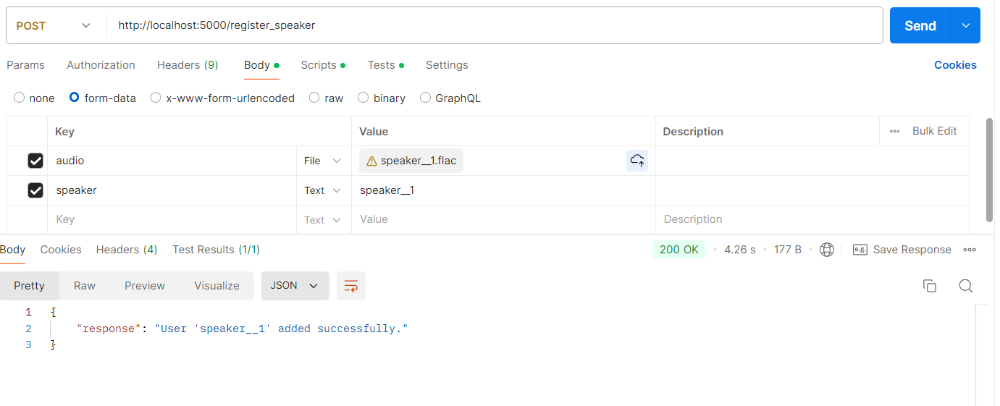
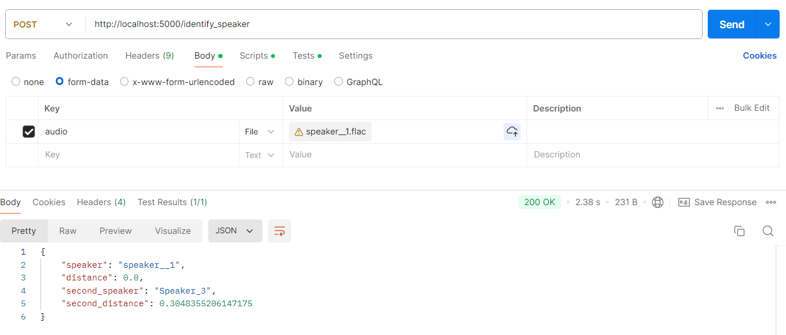

# Speaker Identification System

## Overview

This **Speaker Identification System** identifies speakers by analyzing their voice embeddings. It registers speakers by recording their voices, computing embeddings with `pyannote/embedding`, and saving them in a YAML file. For identification, it compares new recordings against saved embeddings using cosine similarity.

## Features

- **Speaker Registration**
  - Record and compute embeddings using `pyannote/embedding`.
  - Save embeddings in a YAML file.

- **Speaker Identification**
  - Compute embeddings for new recordings.
  - Compare with saved embeddings and return closest matches.

## Embedding Model

Use the pre-trained `pyannote/embedding` model from Hugging Face. 

- **Offline Use:** Download and configure the model locally for faster processing.
- **Online Use:** Obtain a Hugging Face token to access the model via the cloud.

## Installation

1. **Clone the Repository**

   ```bash
   git clone https://github.com/Chiraz32/Speaker-Identification.git
   cd speaker-identification
   ```

2. **Install Dependencies**

   ```bash
   pip install -r requirements.txt
   ```

3. **Configure the YAML File**

   - Ensure `speakers_embeddings.yaml` is present in the root directory.

## Docker

The project includes Docker files to build separate containers for both models and main code:

- **Embedding Model Container**: Contains the `model_api.py` for embedding calculations.
- **Main Application Container**: Contains `main.py` for registration and identification.

To build and run the Docker containers:

```bash
docker build -t embedding-model -f embedding_model/Dockerfile .
docker build -t main-app -f main/Dockerfile .
docker run -p 8000:8000 embedding-model
docker run -p 5080:8080 main-app
```

## Usage

### Register a Speaker

- Endpoint: `/register_speaker`
- Method: POST
- Form Data:
  - `audio`: `.flac` file
  - `speaker`: Unique ID


### Identify a Speaker

- Endpoint:`/identify_speaker`
- Method: POST
- Form Data:
  - `audio`: `.flac` file


## File Structure

```
.
├── data
│   └── speakers_embeddings.yaml
├── embedding_model
│   ├── model_api.py
│   ├── Dockerfile
│   └── requirements.txt
├── main
│   ├── main.py
│   ├── Dockerfile
│   └── requirements.txt
└── README.md
```

## Future Enhancements
- Support multiple recordings per speaker for better accuracy.
- Implement a GUI for easier speaker registration and identification.
- Expand to handle noisy environments and multiple languages.
- Improve frontend to specify identification thresholds and compare distances.


**Pros:** Requires less training data than deep learning models and provides clear results.  
**Cons:** Can be slow with a large number of speakers due to embedding comparisons.

---
